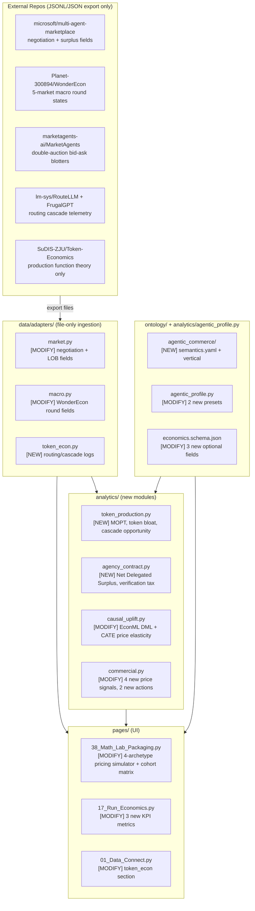

# Agentic Economics & Pricing Integration Plan — v2 (Implementation-Ready)

> **Status**: Revised after deep codebase read. See §"What Was Wrong in v1" for a transparent diff.

---

## Goal

Make CapEcon the definitive **pricing and decision join** for autonomous AI agents — extending it with:
1. Richer upstream adapters that correctly speak the data contracts in `data/adapters/base.py`
2. New analytical engines grounded in token-economics and principal-agent theory
3. A multi-archetype pricing strategy lab inside `pages/38_Math_Lab_Packaging.py`
4. Two new product presets and one new ontology vertical

CapEcon's core thesis does not change: **no vendoring, no live simulator calls. Ingest JSONL, run the decision join, emit GDRs.**

---

## Architecture Map



---

## Critical Fixes from v1

The original plan had **5 correctness issues** and **7 completeness gaps**. Listed here for transparency.

### Correctness Issues

| # | v1 Claim | Reality | Fix |
|---|---|---|---|
| 1 | "New `data/adapters/token_econ.py` adapter" proposed as its own adapter category | `INGEST_SOURCES` and `EVALUATOR_IDS` in `data/adapters/base.py` are **frozen sets / dicts** — any new adapter category **must** be added there or `stamp_provenance()` will `KeyError` | Add `"token_econ"` to both `INGEST_SOURCES` and `EVALUATOR_IDS` in `base.py` |
| 2 | "New `ontology/agentic_commerce/semantics.yaml`" | `ontology.semantics.load_rules_for_vertical()` discovers YAML files by directory name. The GDR schema's `vertical` enum is **hardcoded** in `growth_decision_record.base.schema.json` — it only allows 6 specific values. A new vertical needs both the YAML directory **and** a schema enum extension | Add `"agentic_commerce"` to the `vertical` enum in the GDR schema |
| 3 | v1 proposed `price_block.py` new modes like `dynamic_cascade` as `PRICING_MODES` | `PRICING_MODES` in `price_block.py` is `("internal_budget", "product_sku", "marketplace_take")`. New commercial actions go through `commercial.py` `PRICE_SIGNALS` and `COMMERCIAL_OWNERS`, not `PRICING_MODES` | No new pricing modes; new signals + actions in `commercial.py` only |
| 4 | v1's `token_production.py` formula used raw regression — would conflict with existing `analytics/economics.py` token pricing already done by `calculate_run_cost()` | Don't re-price tokens. Instead compute **productivity ratios** on already-priced `run_cost_usd` column | `token_production.py` reads `run_cost_usd` from `ws.runs`, never recalculates |
| 5 | v1 said EconML extends `analytics/causal_uplift.py` for "price elasticity" — but the existing module is exclusively experiment-gated capability **uplift** (binary success). Price elasticity lives in `analytics/demand_model.py` + `analytics/demand_panel.py` | EconML enhancement targets `analytics/demand_model.py` (`fit_demand()`), not `causal_uplift.py`. Capability uplift stays in `causal_uplift.py` | Two separate function additions, two separate files |

### Completeness Gaps

| # | Gap | What's Needed |
|---|---|---|
| G1 | No fixture contract specified for `token_econ` adapter | Define exact JSONL schema |
| G2 | `01_Data_Connect.py` needs a new section for token_econ but v1 omitted it | Add token_econ section to Data Connect |
| G3 | Agency contract needs to surface on the GDR's `economics` block — v1 didn't specify which schema fields | Add `verification_cost_usd` and `agency_surplus_usd` to `economics.schema.json` |
| G4 | No specification of how the 4 pricing archetypes wire into existing `fill_price_block()` / `packaging_sensitivity.py` | Specify exact calls and new functions in `packaging_sensitivity.py` |
| G5 | v1 proposed `SPRT_audit_hitl` as a commercial action but `COMMERCIAL_OWNERS` only has 6 roles — who owns it? | Add `"spot_audit_hitl": "operations"` to `COMMERCIAL_OWNERS` |
| G6 | `pyproject.toml` TOML syntax error was described but fix was incomplete — `deadline = None` is Python not TOML | Correct TOML: use `deadline = 0` (Hypothesis reads 0 as no deadline) |
| G7 | No register of which existing tests break when `INGEST_SOURCES` expands | Note: `tests/unit/test_adapters_scrub.py` iterates all sources — must add `token_econ` |

---

## Proposed Changes — Implementation Detail

### Phase 0: TOML Syntax Fix (Prerequisite — Do First)

#### [MODIFY] `pyproject.toml` — lines 100–110

```toml
# BEFORE (invalid — None is Python, not TOML):
[tool.hypothesis]
profiles = {
    "dev": {
        "max_examples": 10,
        "deadline": None,
    },
    ...
}

# AFTER (valid TOML, Hypothesis reads deadline=0 as no limit):
[tool.hypothesis.profiles.dev]
max_examples = 10
deadline = 0

[tool.hypothesis.profiles.ci]
max_examples = 100
deadline = 0
```

---

### Phase 1: Adapter Infrastructure

#### [MODIFY] `data/adapters/base.py`

Add `token_econ` to both registries:

```python
EVALUATOR_IDS = {
    "market":     "capecon_market_adapter",
    "workflow":   "capecon_workflow_adapter",
    "rl":         "capecon_rl_adapter",
    "macro":      "capecon_macro_adapter",
    "abm":        "capecon_abm_adapter",
    "finance":    "capecon_finance_adapter",
    "token_econ": "capecon_token_econ_adapter",   # NEW
}

INGEST_SOURCES = frozenset({
    "uploaded", "otel", "langfuse", "vision",
    "market", "workflow", "rl", "macro", "abm", "finance",
    "token_econ",   # NEW
})
```

Add `ROUTING_COLUMNS` for the new adapter:

```python
ROUTING_COLUMNS = [
    "run_id",
    "router_model",
    "selected_tier",
    "prompt_tokens",
    "completion_tokens",
    "cached_tokens",
    "cost_usd",
    "latency_ms",
    "cache_hit",
    "cascade_step_index",
    "verification_status",
    "recorded_at",
]
```

#### [MODIFY] `data/adapters/market.py`

Extend `ingest_market_records()` to handle negotiation fields from Magentic Marketplace:

```python
# New fields to parse per record:
initial_bid = as_float(rec.get("initial_bid_usd"), None)
final_bid   = as_float(rec.get("final_bid_usd") or rec.get("agreed_price_usd"), None)
buyer_val   = as_float(rec.get("buyer_valuation_usd"), None)
seller_cost = as_float(rec.get("seller_cost_usd"), None)
n_rounds    = int(rec.get("negotiation_rounds") or rec.get("proposal_count") or 0)
order_type  = str(rec.get("order_type") or "market")   # "limit" | "market"
spread      = as_float(rec.get("bid_ask_spread_usd"), None)

# Derived: negotiation friction ratio (how much buyer conceded)
neg_discount = None
if initial_bid and final_bid and initial_bid > 0:
    neg_discount = round((initial_bid - final_bid) / initial_bid, 4)

# Add to txn_rows dict:
"negotiation_rounds":   n_rounds,
"initial_bid_usd":      initial_bid,
"final_bid_usd":        final_bid,
"buyer_valuation_usd":  buyer_val,
"seller_cost_usd":      seller_cost,
"negotiation_discount": neg_discount,
"order_type":           order_type,
"bid_ask_spread_usd":   spread,
```

> **Note**: These extra columns will survive `align_frame()` because `align_frame` only **drops** columns not in `AGENT_TXN_COLUMNS` from the *canonical* frame, but extra columns are preserved in the returned DataFrame for marketplace analytics. Verify by checking `align_frame` behavior — it pads missing columns with NaN, doesn't strip extras.

#### [MODIFY] `data/adapters/macro.py`

Add WonderEcon 5-market round fields and human counterfactual records:

```python
def ingest_macro_records(records: list[dict[str, Any]]) -> dict[str, Any]:
    outcome_rows: list[dict] = []
    usage_rows: list[dict] = []
    approval_rows: list[dict] = []   # NEW: human counterfactual overrides

    for i, rec in enumerate(records):
        # Existing fields unchanged...

        # NEW: WonderEcon-specific fields
        agent_type  = str(rec.get("agent_type") or "macro_agent")   # household | firm | bank | gov
        belief_text = str(rec.get("belief_summary") or "")          # MUST be scrubbed
        price_target = as_float(rec.get("price_target_usd"), None)
        action_type  = str(rec.get("action_type") or "")

        # Human counterfactual — maps to approvals table
        human_override = rec.get("human_override")
        if human_override:
            approval_rows.append({
                "approval_id":  f"APPR-MACRO-{i:04d}",
                "run_id":        run_id,
                "decision":      "override",    # not dismiss/confirm — new value; add to classifier
                "occurred_at":   occurred,
                "agent_outcome": str(rec.get("agent_action") or ""),
                "human_outcome": str(human_override),
            })
```

> **Watch**: `approvals` table in `Workspace` has a fixed column set. Check `data/agentic_generator.py` to see what `approvals` columns the downstream decision code expects before adding `agent_outcome` / `human_outcome`. If it breaks `analytics/decisions.py` aggregations, add the columns but don't make them required.

#### [NEW] `data/adapters/token_econ.py`

```python
"""RouteLLM / FrugalGPT cascade routing telemetry → runs + spans + usage_events."""

from data.adapters.base import (
    RUNS_COLUMNS, SPANS_COLUMNS, USAGE_COLUMNS, ROUTING_COLUMNS,
    align_frame, as_bool, as_float, load_json_or_jsonl, stamp_provenance,
)

TIER_ORDER = {"flash_lite": 0, "flash": 1, "standard": 2, "reasoning": 3}


def ingest_token_econ_export(path) -> dict:
    records = load_json_or_jsonl(path)
    return ingest_token_econ_records(records)


def ingest_token_econ_records(records: list[dict]) -> dict:
    run_rows, span_rows, usage_rows, routing_rows = [], [], [], []

    for i, rec in enumerate(records):
        query_id    = str(rec.get("query_id") or f"TOKEC-{i:04d}")
        router_mdl  = str(rec.get("router_model") or "unknown_router")
        tier        = str(rec.get("selected_tier") or "standard")
        p_tokens    = int(rec.get("prompt_tokens") or rec.get("tokens_in") or 0)
        c_tokens    = int(rec.get("completion_tokens") or rec.get("tokens_out") or 0)
        cached      = int(rec.get("cached_tokens") or 0)
        cost        = as_float(rec.get("cost_usd"), 0.0)
        latency     = as_float(rec.get("latency_ms"), 0.0)
        cache_hit   = as_bool(rec.get("cache_hit"), cached > 0)
        cascade_idx = int(rec.get("cascade_step_index") or 0)
        verified    = str(rec.get("verification_status") or "unverified")
        recorded    = rec.get("recorded_at") or "2026-01-01T00:00:00Z"
        success     = verified in ("verified", "passed", "accepted")

        run_rows.append({
            "run_id": query_id, "seat_id": str(rec.get("seat_id") or "router"),
            "capability_id": router_mdl, "capability_version_id": f"{router_mdl}:{tier}",
            "started_at": recorded, "success": success, "run_cost_usd": cost,
            "trust_incident": False,
        })
        routing_rows.append({
            "run_id": query_id, "router_model": router_mdl, "selected_tier": tier,
            "prompt_tokens": p_tokens, "completion_tokens": c_tokens,
            "cached_tokens": cached, "cost_usd": cost, "latency_ms": latency,
            "cache_hit": cache_hit, "cascade_step_index": cascade_idx,
            "verification_status": verified, "recorded_at": recorded,
        })
        usage_rows.append({
            "usage_event_id": f"USE-{query_id}", "account_id": str(rec.get("account_id") or "default"),
            "agent_run_id": query_id, "tokens_in": p_tokens, "tokens_out": c_tokens,
            "cost_usd": cost, "recorded_at": recorded,
        })

    return {
        "tables": {
            "runs":           align_frame(run_rows, RUNS_COLUMNS),
            "usage_events":   align_frame(usage_rows, USAGE_COLUMNS),
            "routing_log":    align_frame(routing_rows, ROUTING_COLUMNS),
        },
        "meta": stamp_provenance("token_econ", claim_type="associational"),
    }
```

> **Note**: `routing_log` is a new workspace table. Add it to `Workspace` dataclass in `core/workspace.py` as `routing_log: pd.DataFrame = field(default_factory=pd.DataFrame)`.

---

### Phase 2: Canonical Test Fixtures

All fixtures are **minimal hand-authored JSONL**. No dependency on upstream repos at test time.

#### [NEW] `tests/fixtures/adapters/market/magentic_negotiation.jsonl`

```jsonl
{"transaction_id":"TXN-NEG-001","occurred_at":"2026-06-01T09:00:00Z","seller_id":"SLR-A","buyer_id":"BYR-1","capability_id":"quote_assist","agent_run_id":"RUN-N-001","gmv_usd":2400,"take_rate":0.10,"platform_revenue_usd":240,"agent_inference_cost_usd":0.55,"agent_assist_type":"negotiation_assisted","verified":true,"verified_by":"deterministic_stage","success":true,"outcome_value_usd":120,"initial_bid_usd":2800,"final_bid_usd":2400,"buyer_valuation_usd":2600,"seller_cost_usd":1800,"negotiation_rounds":3,"order_type":"limit","bid_ask_spread_usd":400}
{"transaction_id":"TXN-NEG-002","occurred_at":"2026-06-01T10:00:00Z","seller_id":"SLR-B","buyer_id":"BYR-2","capability_id":"checkout_assist","agent_run_id":"RUN-N-002","gmv_usd":600,"take_rate":0.12,"platform_revenue_usd":72,"agent_inference_cost_usd":1.20,"agent_assist_type":"checkout_completed","verified":false,"verified_by":"deterministic_stage","success":false,"initial_bid_usd":700,"final_bid_usd":600,"negotiation_rounds":1,"order_type":"market"}
```

#### [NEW] `tests/fixtures/adapters/macro/wonderecon_round.jsonl`

```jsonl
{"period_id":"2026-M01-R03","region_id":"W-ECONOMY","agent_type":"household","aggregate_output_usd":12000,"agent_cost_usd":85,"tokens_in":4200,"tokens_out":1800,"period_end":"2026-01-31T00:00:00Z","success":true,"belief_summary":"[SCRUBBED]","price_target_usd":24.50,"action_type":"consume","human_override":null}
{"period_id":"2026-M01-R04","region_id":"W-ECONOMY","agent_type":"firm","aggregate_output_usd":8500,"agent_cost_usd":110,"tokens_in":5000,"tokens_out":2200,"period_end":"2026-01-31T00:00:00Z","success":true,"belief_summary":"[SCRUBBED]","price_target_usd":32.00,"action_type":"produce","human_override":"price_target_usd:29.00"}
```

#### [NEW] `tests/fixtures/adapters/token_econ/routellm_cascade.jsonl`

```jsonl
{"query_id":"QRY-001","seat_id":"s-101","router_model":"matrix_router_v1","selected_tier":"flash_lite","prompt_tokens":320,"completion_tokens":80,"cached_tokens":200,"cost_usd":0.0004,"latency_ms":120,"cache_hit":true,"cascade_step_index":0,"verification_status":"passed","recorded_at":"2026-06-01T08:00:00Z"}
{"query_id":"QRY-002","seat_id":"s-102","router_model":"matrix_router_v1","selected_tier":"reasoning","prompt_tokens":1800,"completion_tokens":600,"cached_tokens":0,"cost_usd":0.042,"latency_ms":3200,"cache_hit":false,"cascade_step_index":1,"verification_status":"verified","recorded_at":"2026-06-01T08:01:00Z"}
```

---

### Phase 3: Analytical Engines

#### [NEW] `analytics/token_production.py`

Token production efficiency — **reads `run_cost_usd` already computed**, never re-prices:

```python
"""Token production efficiency: MOPT, token bloat, cascade opportunity.

Reads run_cost_usd from ws.runs (already computed by analytics/economics.py).
Does NOT reprice tokens. Computes productivity ratios and diminishing-returns curves.
"""
from __future__ import annotations
from typing import Any
import numpy as np
import pandas as pd
from core.workspace import Workspace


def marginal_outcome_per_token(runs: pd.DataFrame) -> dict[str, Any]:
    """
    Estimate MOPT = ΔSuccess / Δ(tokens_in).
    Uses log-linear regression on (tokens, success) per capability.
    Returns dict: {capability_id -> {"mopt": float, "saturation": bool, "n": int}}
    """
    required = {"run_id", "capability_id", "tokens_in", "success", "run_cost_usd"}
    if runs.empty or not required.issubset(runs.columns):
        return {}
    out = {}
    for cap_id, grp in runs.groupby("capability_id"):
        grp = grp.dropna(subset=["tokens_in", "success"])
        if len(grp) < 10:
            continue
        x = np.log1p(grp["tokens_in"].astype(float).values)
        y = grp["success"].astype(float).values
        # OLS slope of log-tokens on success
        if np.std(x) < 1e-6:
            continue
        slope = float(np.cov(x, y)[0, 1] / np.var(x))
        saturation = slope < 0.005   # near-zero marginal return
        out[str(cap_id)] = {
            "mopt": round(slope, 6),
            "saturation": saturation,
            "n": len(grp),
            "mean_cost_usd": round(float(grp["run_cost_usd"].mean()), 6),
        }
    return out


def token_bloat_flags(ws: Workspace) -> pd.DataFrame:
    """
    Return capabilities where token cost is high but MOPT is in saturation.
    Columns: capability_id, mean_cost_usd, mopt, saturation, flag.
    """
    runs = ws.runs
    if runs.empty:
        return pd.DataFrame(columns=["capability_id", "mean_cost_usd", "mopt", "saturation", "flag"])
    mopt = marginal_outcome_per_token(runs)
    if not mopt:
        return pd.DataFrame(columns=["capability_id", "mean_cost_usd", "mopt", "saturation", "flag"])
    rows = []
    p75_cost = float(np.percentile([v["mean_cost_usd"] for v in mopt.values()], 75))
    for cap_id, stats in mopt.items():
        flag = stats["saturation"] and stats["mean_cost_usd"] >= p75_cost
        rows.append({
            "capability_id": cap_id,
            "mean_cost_usd": stats["mean_cost_usd"],
            "mopt": stats["mopt"],
            "saturation": stats["saturation"],
            "flag": flag,
        })
    return pd.DataFrame(rows)


def cascade_opportunity(
    ws: Workspace,
    *,
    lite_cost_fraction: float = 0.05,
    quality_floor_success_rate: float = 0.82,
) -> dict[str, Any]:
    """
    Estimate cost savings if saturated capabilities down-routed to lite model.
    Returns {"savings_usd": float, "candidates": list[str], "claim_type": "simulated"}.
    """
    runs = ws.runs
    if runs.empty or "run_cost_usd" not in runs.columns:
        return {"savings_usd": 0.0, "candidates": [], "claim_type": "simulated"}
    flags = token_bloat_flags(ws)
    candidates = flags.loc[flags["flag"], "capability_id"].tolist()
    savings = 0.0
    for cap_id in candidates:
        sub = runs[runs["capability_id"] == cap_id]
        sr = float(sub["success"].mean()) if "success" in sub.columns else 0.0
        if sr >= quality_floor_success_rate:
            cost = float(sub["run_cost_usd"].sum())
            savings += cost * (1.0 - lite_cost_fraction)
    return {
        "savings_usd": round(savings, 2),
        "candidates": candidates,
        "n_candidates": len(candidates),
        "claim_type": (ws.meta or {}).get("claim_type", "simulated"),
    }
```

#### [NEW] `analytics/agency_contract.py`

Principal-agent verification economics. This is **supply-side only** — it tells you whether the agent still makes economic sense to operate, not whether to raise prices:

```python
"""Principal-Agent delegation economics.

Net Delegated Surplus = Value(Verified) × P(Success) − C_inference − C_verification − Risk(Harm)
Agency Deficit fires when inference + review > human baseline.
SPRT spot-check recommendation: how many approvals can you safely skip?
"""
from __future__ import annotations
from typing import Any
import numpy as np
import pandas as pd
from core.workspace import Workspace


def compute_agency_surplus(
    ws: Workspace,
    *,
    human_baseline_usd: float | None = None,
    reviewer_hourly_usd: float | None = None,
    review_minutes: float | None = None,
) -> dict[str, Any]:
    """
    Returns:
        verification_cost_usd  — loaded HITL cost per run (labor)
        inference_cost_usd     — mean run_cost_usd from runs
        agency_surplus_usd     — (human_baseline - inference - verification) per run
        agency_deficit         — bool, True when agent costs more than baseline
        claim_type             — from workspace meta
    """
    profile = ws.profile or {}
    priors = profile.get("priors", {})

    h_baseline = human_baseline_usd or float(priors.get("human_baseline_usd") or 0)
    r_hourly   = reviewer_hourly_usd or float(priors.get("reviewer_loaded_hourly_usd") or 85.0)
    r_mins     = review_minutes or float(priors.get("review_minutes_per_approval") or 4.0)

    runs = ws.runs
    approvals = ws.approvals

    inf_cost = float(runs["run_cost_usd"].mean()) if not runs.empty and "run_cost_usd" in runs.columns else 0.0

    n_approvals = len(approvals) if approvals is not None and not approvals.empty else 0
    n_runs      = max(len(runs), 1)
    review_cost_per_run = (n_approvals / n_runs) * (r_hourly / 60.0 * r_mins)

    surplus = h_baseline - inf_cost - review_cost_per_run
    src = (ws.meta or {}).get("data_source", "synthetic")
    claim_type = "simulated" if src in ("synthetic", None, "") else "associational"

    return {
        "inference_cost_usd":     round(inf_cost, 6),
        "verification_cost_usd":  round(review_cost_per_run, 6),
        "human_baseline_usd":     h_baseline,
        "agency_surplus_usd":     round(surplus, 4),
        "agency_deficit":         surplus < 0,
        "claim_type":             claim_type,
    }


def sprt_spot_check_threshold(
    ws: Workspace,
    *,
    alpha: float = 0.05,
    beta: float = 0.10,
    p0_harm: float = 0.02,
    p1_harm: float = 0.06,
) -> dict[str, Any]:
    """
    Sequential probability ratio test parameters for relaxing 100% HITL to spot-check.
    Returns sample_size needed and whether spot-check is safe given current harm rate.
    """
    runs = ws.runs
    if runs.empty:
        return {"spot_check_safe": False, "n_needed": None, "current_harm_rate": None}

    harm_rate = float(runs["trust_incident"].mean()) if "trust_incident" in runs.columns else 0.0
    # SPRT fixed-sample approximation: n ≈ (Zα + Zβ)² × p(1-p) / (p1-p0)²
    p_bar = (p0_harm + p1_harm) / 2
    n_needed = int(np.ceil(
        ((1.645 + 1.28) ** 2 * p_bar * (1 - p_bar)) / ((p1_harm - p0_harm) ** 2)
    ))
    spot_check_safe = harm_rate <= p0_harm and len(runs) >= n_needed

    return {
        "spot_check_safe":    spot_check_safe,
        "n_needed":           n_needed,
        "current_harm_rate":  round(harm_rate, 4),
        "p0_harm":            p0_harm,
        "p1_harm":            p1_harm,
    }
```

#### [MODIFY] `analytics/demand_model.py` — EconML integration

Add `estimate_heterogeneous_elasticity()` alongside existing `fit_demand()`. **Does not replace** the PyMC path:

```python
def estimate_heterogeneous_elasticity(
    panel: pd.DataFrame,
    feature_cols: list[str] | None = None,
    *,
    min_samples: int = 150,
) -> dict[str, Any]:
    """
    Causal Forest DML estimate of heterogeneous price elasticity.
    Falls back to OLS log-log when econml not installed or underpowered.

    Args:
        panel: build_demand_panel() output — columns sku, price, quantity, [control_*]
        feature_cols: subset of control_* columns to use as heterogeneity moderators
        min_samples: minimum rows for CausalForestDML; below this → OLS fallback

    Returns dict with:
        elasticity_mean, elasticity_std, method, claim_type, underpowered, skus
    """
    if panel.empty or "price" not in panel.columns or "quantity" not in panel.columns:
        return {"elasticity_mean": None, "underpowered": True, "claim_type": "simulated"}

    n = len(panel)
    underpowered = n < min_samples

    if not underpowered:
        try:
            from econml.dml import CausalForestDML
            import sklearn  # noqa: F401
            T = np.log(panel["price"].values.reshape(-1, 1))
            Y = np.log(panel["quantity"].clip(lower=1).values)
            X_cols = [c for c in (feature_cols or []) if c in panel.columns]
            X = panel[X_cols].fillna(0).values if X_cols else np.ones((n, 1))
            model = CausalForestDML(n_estimators=100, random_state=42)
            model.fit(Y, T.ravel(), X=X)
            effects = model.effect(X)
            return {
                "elasticity_mean": round(float(np.mean(effects)), 4),
                "elasticity_std":  round(float(np.std(effects)), 4),
                "method": "CausalForestDML",
                "claim_type": "associational",
                "underpowered": False,
                "skus": {},   # segment-level expansion: future work
            }
        except ImportError:
            pass   # fall through to OLS

    # OLS log-log fallback
    import warnings
    log_p = np.log(panel["price"].clip(lower=1e-6).values)
    log_q = np.log(panel["quantity"].clip(lower=1).values)
    if np.std(log_p) < 1e-6:
        return {"elasticity_mean": None, "underpowered": True, "claim_type": "simulated",
                "method": "ols_fallback", "message": "No price variation"}
    with warnings.catch_warnings():
        warnings.simplefilter("ignore")
        slope = float(np.cov(log_p, log_q)[0, 1] / np.var(log_p))
    return {
        "elasticity_mean": round(slope, 4),
        "elasticity_std":  None,
        "method": "ols_log_log_fallback",
        "claim_type": "simulated",
        "underpowered": underpowered,
    }
```

#### [MODIFY] `analytics/commercial.py`

Add new `PRICE_SIGNALS`, extend `COMMERCIAL_OWNERS`:

```python
# Add to PRICE_SIGNALS tuple:
PRICE_SIGNALS = (
    "unpriceable",
    "within_policy",
    "mesh_leak",
    "below_tier_list",
    "list_below_demand_opt",
    "below_floor",
    "over_baseline",
    "flat_bucket_over_cap",
    "severely_over_cap",
    "over_cap",
    "token_bloat",           # NEW: saturated capability overspending tokens
    "agency_deficit",        # NEW: inference+review > human baseline
)

# Add to COMMERCIAL_OWNERS:
COMMERCIAL_OWNERS = {
    ...existing...,
    "dynamic_cascade": "platform",     # NEW: route to cheaper model tier
    "spot_audit_hitl": "operations",   # NEW: relax 100% review to SPRT spot-check
}

# Extend _default_commercial_action_map():
    "token_bloat": {
        "commercial_action": "dynamic_cascade",
        "rationale": "Token spend saturated with negligible lift — down-route to cheaper tier.",
    },
    "agency_deficit": {
        "commercial_action": "spot_audit_hitl",
        "rationale": "Review labor exceeds savings vs. human baseline — spot-check to reduce verification tax.",
    },
```

---

### Phase 4: GDR Schema Extensions

#### [MODIFY] `ontology/shared/economics.schema.json`

Add three new optional fields (non-breaking — all optional):

```json
"verification_cost_usd":  { "type": ["number", "null"] },
"agency_surplus_usd":     { "type": ["number", "null"] },
"token_mopt":             { "type": ["number", "null"],
                            "description": "Marginal outcome probability per 1k tokens" }
```

#### [MODIFY] `ontology/shared/growth_decision_record.base.schema.json`

Add `"agentic_commerce"` to the `vertical` enum (line 20):

```json
"enum": [
  "capability_lifecycle", "agent_runtime", "orchestration",
  "eval_governance", "marketplace_commerce", "clinical_runtime",
  "agentic_commerce"
]
```

---

### Phase 5: New Ontology Vertical

#### [NEW] `ontology/agentic_commerce/semantics.yaml`

Covers autonomous marketplace agents: bilateral negotiation, algorithmic pricing, take-rate management.

```yaml
vertical: agentic_commerce
ontology_version: agentic_commerce_v1
taxonomy_module: ontology.exception_taxonomy

subject:
  capability_id: "Autonomous marketplace agent (quote, negotiate, checkout)"
  seller_id: "Platform seller account"
  workspace_id: "Marketplace tenant"

decision.verdict:
  healthy: "Take margin positive, no pricing anomalies"
  leaking: "Negotiation discount eroding platform revenue"
  destructive: "Pricing collusion risk or predatory undercutting detected"
  uneconomic: "Inference cost exceeds platform take at current GMV"
  underpowered: "Insufficient transaction volume for reliable signal"
  needs_review: "Mixed or ambiguous pricing signals"

economics.primary_metric_label: platform_net_margin_usd

classification:
  thresholds:
    negotiation_slippage:
      max_discount_rate: 0.20       # agent conceded >20% from initial bid
    take_rate_squeeze:
      min_net_margin_pct: 0.02      # platform net margin after inference < 2%
    bid_ask_spread_anomaly:
      max_spread_to_gmv_ratio: 0.40 # spread > 40% of GMV
    inference_over_take:
      max_inference_take_ratio: 0.50 # inference cost > 50% of take revenue

decision:
  verdict_default: needs_review
  verdict_rules:
    - verdict: destructive
      when_any_category: [bid_ask_spread_anomaly]
    - verdict: uneconomic
      when_any_category: [inference_over_take, take_rate_squeeze]
    - verdict: leaking
      when_any_category: [negotiation_slippage]
    - verdict: underpowered
      when_exception_count_lt: 1
    - verdict: needs_review
      default: true

  action_map:
    healthy:
      recommended_action: ship
      requires_review: false
      rationale: "Marketplace agent operating within take and inference policy."
    leaking:
      recommended_action: throttle
      requires_review: false
      rationale: "Agent conceding too much — tighten negotiation policy bounds."
    destructive:
      recommended_action: hold
      requires_review: true
      rationale: "Pricing anomaly may indicate collusion or manipulation — human review."
    uneconomic:
      recommended_action: hold
      requires_review: false
      rationale: "Platform net margin below floor — review inference model tier."
    underpowered:
      recommended_action: hold
      requires_review: false
      rationale: "Insufficient volume — gather more transactions."
    needs_review:
      recommended_action: hold
      requires_review: true
      rationale: "Mixed marketplace signals — human must confirm."

  commercial_action_map:
    within_policy:  { commercial_action: null }
    inference_over_take: { commercial_action: dynamic_cascade,
                           rationale: "Inference eats take margin — down-route to cheaper model." }
    take_rate_squeeze:   { commercial_action: raise_list,
                           rationale: "Expand take rate or raise minimum transaction fee." }
    token_bloat:         { commercial_action: dynamic_cascade,
                           rationale: "Negotiation agent over-spending tokens per transaction." }
```

---

### Phase 6: New Product Presets

#### [MODIFY] `analytics/agentic_profile.py` — two new entries in `PRESETS`

```python
"agentic_commerce": {
    "preset_id": "agentic_commerce",
    "label": "Agentic Commerce — autonomous negotiation & checkout",
    "ontology_vertical": "agentic_commerce",
    "ontology_version": "agentic_commerce_v1",
    "billing_model": "usage_based",
    "pricing_mode": "marketplace_take",
    "default_model": "gpt-4o",
    "max_loops_threshold": 6,
    "cache_hit_rate": 0.55,
    "description": (
        "Two-sided marketplace where AI agents negotiate, quote, and checkout autonomously. "
        "Platform take must cover inference cost plus negotiation labor overhead."
    ),
    "priors": {
        "n_seats": 400,
        "n_capabilities": 6,
        "activation_rate": 0.65,
        "weekly_habit_rate": 0.55,
        "approval_fatigue_rate": 0.10,
        "trust_incident_rate": 0.03,
        "connector_error_rate": 0.08,
        "run_cost_per_success": 0.45,
        "seat_arpu_monthly": 0.0,
        "monthly_churn_base": 0.05,
        "revenue_per_1k_tokens": 0.0,
        "take_rate": 0.10,
        "agent_assist_share": 0.70,
        "max_negotiation_discount": 0.15,
        "policy_cpso_cap": 0.15,
        "reviewer_loaded_hourly_usd": 75.0,
        "review_minutes_per_approval": 2.0,
    },
},
"frugal_router": {
    "preset_id": "frugal_router",
    "label": "Cost-Optimized Router — model cascade & caching",
    "ontology_vertical": "agent_runtime",
    "ontology_version": "agent_runtime_v1",
    "billing_model": "usage_based",
    "pricing_mode": "product_sku",
    "default_model": "flash_lite",
    "max_loops_threshold": 3,
    "cache_hit_rate": 0.80,
    "description": (
        "High-volume API product relying on RouteLLM-style model cascades and aggressive caching. "
        "Token cost management is the primary margin lever."
    ),
    "priors": {
        "n_seats": 2000,
        "n_capabilities": 8,
        "activation_rate": 0.70,
        "weekly_habit_rate": 0.60,
        "approval_fatigue_rate": 0.05,
        "trust_incident_rate": 0.02,
        "connector_error_rate": 0.05,
        "run_cost_per_success": 0.008,
        "seat_arpu_monthly": 0.0,
        "monthly_churn_base": 0.09,
        "revenue_per_1k_tokens": 0.01,
        "policy_cpso_cap": 0.02,
        "budget_cap_per_outcome_usd": 0.05,
        "human_baseline_usd": 0.0,
        "reviewer_loaded_hourly_usd": 0.0,
        "review_minutes_per_approval": 0.0,
    },
},
```

---

### Phase 7: Pricing Strategy Lab (Packaging Page)

#### [MODIFY] `analytics/packaging_sensitivity.py` — new archetype functions

```python
def archetype_cohort_matrix(
    floor_usd: float,
    seat_arpu_monthly: float,
    outcomes_per_seat_month: float,
    n_deciles: int = 10,
) -> pd.DataFrame:
    """
    Generate a gross margin matrix across account deciles for four pricing archetypes.
    Deciles represent outcome volume distribution (power-law: top decile = 10× median).

    Returns DataFrame with columns:
        decile, outcomes_per_month, seat_based_margin, outcome_based_margin,
        hybrid_margin, sla_margin
    """
    import numpy as np
    # Power-law outcome distribution across deciles
    decile_multipliers = np.array([0.15, 0.25, 0.40, 0.55, 0.70, 0.90, 1.10, 1.50, 2.20, 4.50])
    rows = []
    for i, mult in enumerate(decile_multipliers):
        n_out = outcomes_per_seat_month * mult
        cost  = floor_usd * n_out

        seat_margin    = seat_arpu_monthly - cost
        outcome_margin = (floor_usd / (1 - 0.30)) * n_out - cost  # 30% target margin
        hybrid_base    = seat_arpu_monthly * 0.4
        hybrid_over    = max(0.0, n_out - outcomes_per_seat_month) * (floor_usd / (1 - 0.25))
        hybrid_margin  = (hybrid_base + hybrid_over) - cost
        sla_premium    = floor_usd * n_out * 0.12   # 12% SLA risk buffer
        sla_margin     = outcome_margin + sla_premium - cost * 0.05  # expected rebate

        rows.append({
            "decile":                i + 1,
            "outcomes_per_month":    round(n_out, 1),
            "seat_based_margin":     round(seat_margin, 2),
            "outcome_based_margin":  round(outcome_margin, 2),
            "hybrid_margin":         round(hybrid_margin, 2),
            "sla_margin":            round(sla_margin, 2),
        })
    return pd.DataFrame(rows)


def archetype_summary(
    floor_usd: float,
    seat_arpu: float,
    median_outcomes: float,
    target_margin: float = 0.30,
    sla_buffer: float = 0.12,
) -> dict[str, dict]:
    """
    Single-row summary for each of the four pricing archetypes at median volume.
    Returns dict keyed by archetype name with fields: list_usd, margin_usd, margin_pct.
    """
    seat = {
        "list_usd": seat_arpu,
        "margin_usd": round(seat_arpu - floor_usd * median_outcomes, 2),
        "note": "Fixed monthly per seat",
    }
    outcome_list = round(floor_usd / (1 - target_margin), 4)
    outcome = {
        "list_usd": outcome_list,
        "margin_usd": round((outcome_list - floor_usd) * median_outcomes, 2),
        "note": f"Pure outcome @ ${outcome_list:.3f}/outcome",
    }
    hybrid_base = seat_arpu * 0.4
    hybrid_over = outcome_list * 0.8
    hybrid_rev  = hybrid_base + max(0, median_outcomes - median_outcomes * 0.6) * hybrid_over
    hybrid = {
        "list_usd": hybrid_base,
        "overage_usd": hybrid_over,
        "margin_usd": round(hybrid_rev - floor_usd * median_outcomes, 2),
        "note": f"${hybrid_base:.2f}/mo + ${hybrid_over:.3f}/outcome overage",
    }
    sla_list = outcome_list * (1 + sla_buffer)
    sla = {
        "list_usd": round(sla_list, 4),
        "margin_usd": round((sla_list - floor_usd) * median_outcomes, 2),
        "note": f"Outcome + {sla_buffer:.0%} SLA risk premium",
    }
    return {
        "seat_based": seat,
        "outcome_based": outcome,
        "hybrid": hybrid,
        "sla_backed": sla,
    }
```

#### [MODIFY] `pages/38_Math_Lab_Packaging.py`

Add a new `section_kicker("Pricing archetype comparison")` block **after** the existing demand curve section:

```python
section_kicker("Pricing archetype comparison")
st.caption(
    "Four archetypes modelled at synthetic volume distribution. "
    "Source: analytics/packaging_sensitivity.py :: archetype_cohort_matrix(). "
    "Claim: simulated (teaching)."
)
from analytics.packaging_sensitivity import archetype_cohort_matrix, archetype_summary

med_outcomes = float(ws.profile.get("priors", {}).get(
    "outcomes_per_seat_month", 
    max(1.0, (ws.runs["success"].sum() / max(len(ws.seats), 1)) if not ws.runs.empty else 8.0)
))
arpa = float(ws.profile.get("priors", {}).get("seat_arpu_monthly", 49.99))

archetype_cols = st.columns(4)
summary = archetype_summary(floor_usd, arpa, med_outcomes, target_margin)
labels  = ["Seat-Based", "Pure Outcome", "Hybrid", "SLA-Backed"]
keys    = ["seat_based", "outcome_based", "hybrid", "sla_backed"]
for col, label, key in zip(archetype_cols, labels, keys):
    arch = summary[key]
    col.metric(label, f"${arch['margin_usd']:,.2f}/mo margin",
               help=arch.get("note", ""))

section_kicker("Cohort gross margin by usage decile")
matrix_df = archetype_cohort_matrix(floor_usd, arpa, med_outcomes)
fig_matrix = go.Figure()
for arch in ["seat_based_margin", "outcome_based_margin", "hybrid_margin", "sla_margin"]:
    fig_matrix.add_trace(go.Bar(
        x=matrix_df["decile"], y=matrix_df[arch],
        name=arch.replace("_margin", "").replace("_", " ").title(),
    ))
fig_matrix.update_layout(barmode="group", xaxis_title="Usage Decile",
                          yaxis_title="Gross Margin USD/mo",
                          height=350)
st.plotly_chart(fig_matrix, use_container_width=True)
st.caption(
    "Negative seat-based margin at high deciles = power-user subsidy. "
    "Outcome-based pricing restores monotonic margin growth."
)
```

#### [MODIFY] `pages/17_Run_Economics.py`

Add three new KPIs after existing `_cols` row (after line ~73):

```python
# New analytics imports at top of file:
from analytics.token_production import cascade_opportunity, token_bloat_flags
from analytics.agency_contract import compute_agency_surplus

# After existing metric row:
section_kicker("Token production & agency economics")
_tok_cols = st.columns(3)
cascade = cascade_opportunity(ws)
agency  = compute_agency_surplus(ws)
bloat_df = token_bloat_flags(ws)
n_bloat  = int(bloat_df["flag"].sum()) if not bloat_df.empty else 0

_tok_cols[0].metric(
    "Token bloat capabilities",
    str(n_bloat),
    help="Capabilities where token cost saturates without marginal outcome lift.",
)
_tok_cols[1].metric(
    "Cascade savings estimate",
    f"${cascade['savings_usd']:,.2f}",
    help="Estimated monthly savings from down-routing saturated capabilities (simulated).",
)
delta_str = f"${abs(agency['agency_surplus_usd']):.3f} {'deficit' if agency['agency_deficit'] else 'surplus'}"
_tok_cols[2].metric(
    "Agency surplus / deficit",
    delta_str,
    delta=f"vs ${agency['human_baseline_usd']:.2f} baseline",
    delta_color="inverse" if agency["agency_deficit"] else "normal",
)
```

#### [MODIFY] `pages/01_Data_Connect.py`

Add `token_econ` section after the existing `section_kicker("More sim exports")` block:

```python
section_kicker("Token routing telemetry (RouteLLM / FrugalGPT)")
st.caption("Cascade routing logs → runs + usage_events + routing_log. claim_type: associational.")
from data.adapters.token_econ import ingest_token_econ_export

tok_file = st.file_uploader("Routing log JSONL", type=["jsonl", "json"], key="tok_up")
t1, t2 = st.columns(2)
with t1:
    if st.button("Load routing fixture"):
        pack = ingest_token_econ_export(ADAPTER_FIXTURES / "token_econ" / "routellm_cascade.jsonl")
        _apply_pack(pack, "token_econ")
        st.success(f"Routing fixture — {len(pack['tables']['runs'])} queries.")
        st.rerun()
with t2:
    if tok_file and st.button("Parse routing upload"):
        tmp = Path("/tmp/capecon_token_econ.jsonl")
        tmp.write_bytes(tok_file.getvalue())
        pack = ingest_token_econ_export(tmp)
        _apply_pack(pack, "token_econ")
        st.success(f"{len(pack['tables']['runs'])} queries parsed.")
        st.rerun()
```

---

### Phase 8: Workspace Dataclass Extension

#### [MODIFY] `core/workspace.py`

Add `routing_log` table to `Workspace` dataclass (after `spend_by_step`):

```python
routing_log: pd.DataFrame = field(default_factory=pd.DataFrame)
```

---

## Verification Plan

### Automated Tests

```powershell
# 0. Check TOML is now valid (must return 0)
python -c "import tomllib; tomllib.loads(open('pyproject.toml').read())"

# 1. Adapter unit tests — market negotiation fields
pytest -v tests/unit/test_adapters_econ.py -k "market"

# 2. New adapter — token_econ (new test file)
pytest -v tests/unit/test_adapters_token_econ.py

# 3. Analytics engines — token production, agency contract
pytest -v tests/unit/test_token_production.py
pytest -v tests/unit/test_agency_contract.py

# 4. Packaging sensitivity — archetype functions
pytest -v tests/unit/test_packaging_sensitivity.py

# 5. Demand model — elasticity estimation
pytest -v tests/unit/test_demand_model.py

# 6. Commercial signals — new price signals
pytest -v tests/unit/test_commercial.py

# 7. Ontology schema — new vertical enum value
pytest -v ontology/tests/test_validate.py

# 8. Full regression pass
pytest -p no:warnings -q
```

### New Test Files Required

| File | What it tests |
|---|---|
| `tests/unit/test_adapters_token_econ.py` | `ingest_token_econ_records()` → correct columns, `claim_type: associational`, scrub pass |
| `tests/unit/test_token_production.py` | `marginal_outcome_per_token()`, `token_bloat_flags()`, `cascade_opportunity()` |
| `tests/unit/test_agency_contract.py` | `compute_agency_surplus()` with zero/positive/negative surplus scenarios, `sprt_spot_check_threshold()` |

### Manual Verification

1. **Data Connect**: Load routing fixture → confirm `routing_log` table appears in workspace banner, `claim_type: associational` shown, no prompt columns survive scrub
2. **Packaging Lab**: Select `frugal_router` preset → archetype cohort matrix renders with meaningful margin differences across deciles; outcome-based margin is monotone
3. **Run Economics**: Select any profile → Token Bloat count, Cascade Savings, and Agency Surplus all render; agency_deficit triggers `inverse` delta color when true
4. **Agentic Commerce vertical**: Load market negotiation fixture, select `agentic_commerce` preset → Marketplace Radar shows `platform_net_margin_usd` as headline metric, Semantics Console shows `agentic_commerce` vertical

---

## What Was Wrong in v1

| Issue | v1 Error | v2 Fix |
|---|---|---|
| **base.py registry** | Didn't mention expanding `INGEST_SOURCES` + `EVALUATOR_IDS` | Explicit dict/frozenset additions with exact syntax |
| **GDR vertical enum** | Said "new ontology vertical" without noting schema enum must expand | Added `"agentic_commerce"` to the JSON Schema enum |
| **PRICING_MODES confusion** | Implied new commercial behaviors went into `PRICING_MODES` | Correctly routed to `PRICE_SIGNALS` + `COMMERCIAL_OWNERS` in `commercial.py` |
| **Token repricing conflict** | `token_production.py` formulas would conflict with `calculate_run_cost()` | Module now reads `run_cost_usd`, computes productivity ratios only |
| **EconML in wrong file** | Said EconML extends `causal_uplift.py` for elasticity | EconML goes in `demand_model.py`; `causal_uplift.py` keeps experiment-gated binary uplift |
| **TOML fix incomplete** | Said `deadline = "none"` | Correct TOML is `deadline = 0` (integer 0 = no deadline in Hypothesis) |
| **`routing_log` table** | Token adapter mentioned but `Workspace` dataclass not updated | Added to `core/workspace.py` dataclass |
| **Data Connect wiring** | `01_Data_Connect.py` not updated for `token_econ` | Full section added with fixture button and upload handler |
| **`approval_rows` column guard** | WonderEcon human overrides land in `approvals` without checking existing column set | Added explicit warning note about checking `agentic_generator.py` column set |
| **`align_frame` behavior** | v1 implied it strips unknown columns — it pads canonical columns with NaN and preserves extras | Clarified in market adapter note |
