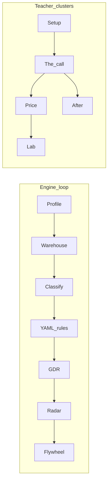

# Architecture (join, not a runtime)

churnOS sits on the join: traces × verified outcomes × trust × cost-to-serve.
It does not replace LangGraph, Langfuse, or Stripe.

## What churnOS is (not a runtime)

```
  builder owns                          churnOS join
  ┌──────────────┐                    ┌──────────────────┐
  │ LangGraph /  │  traces            │ warehouse        │
  │ Langfuse     │ ─────────────────► │ outcomes × cost  │
  │ Stripe       │  invoices          │ × trust          │
  └──────────────┘                    └────────┬─────────┘
                                               │
                                               ▼
                                      ┌──────────────────┐
                                      │ GDR              │
                                      │ floor / claim /  │
                                      │ ship or hold     │
                                      └──────────────────┘
```

**Key insight:** Radar does not run the agent. It prices leaving it live.

## Engine loop vs teacher clusters



- **Engine:** Profile → Warehouse → Classify → YAML → GDR → Radar → Flywheel.
- **Teacher clusters (sidebar + page strips + stepper):** Setup → Call → Price → Lab → After.

Orientation is a **strip on every page**, not a destination. Full atlas: Reference → Architecture.
