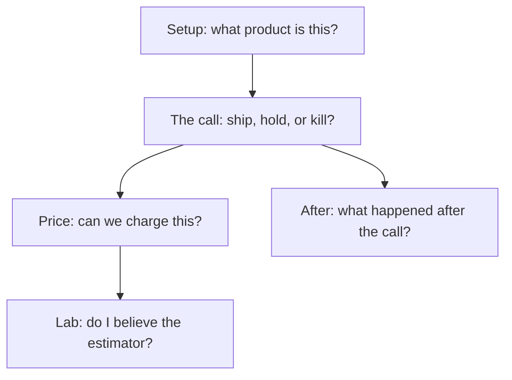

# Information architecture

One question per nav group. Each page repeats that question in a slim orientation strip.



| Group | Question | Pages |
| --- | --- | --- |
| **Setup** | What product is this? | Profile, Data Connect, Outcome Definition |
| **The call** | Ship, hold, or kill? | Version Gate, Inbox, Radar · receipts: Activation, Trust, Connectors, Subgraph, Version Compare |
| **Price** | Can we charge this? | Run Economics (home); Lab · Packaging under Learn |
| **Learn** | Do I believe the estimator / what after? | Exec, Experiments, Flags, Flywheel, then seven Lab · X |
| **Config** | How do hooks fire? | Integrations; Reference / Legacy collapsed |

## Sidebar before / after

```
  TODAY DECIDE                         AFTER
  Version Gate                         THE CALL
  Inbox                                  Version Gate
  Radar                                  Inbox
  Subgraph                               Radar
  Activation                             · Activation
  Trust                                  · Trust
  Run Economics                          · Connectors
  Connectors                             · Subgraph
  Marketplace Radar                      · Version Compare
  Clinical Radar                       PRICE
  Version Compare                        Run Economics
                                       Lab · Packaging
```

## Price cluster

```
  Outcome Definition ── priors / verified success
  Run Economics      ── floor, CPSO, WTP, Fit demand  ← land here
  Lab · Packaging    ── authored ε or fitted log-log
  GDR caption        ── surplus-opt / list_below_demand_opt
```

Full atlas diagrams: in-app **Reference → Architecture**.
